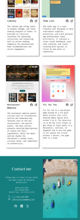

# The Odin Project's Homepage Project

This is a solution for [Homepage project on The Odin Project](https://www.theodinproject.com/lessons/node-path-advanced-html-and-css-homepage)

## Table of contents

- [The Odin Project's Homepage Project](#the-odin-projects-homepage-project)
  - [Table of contents](#table-of-contents)
  - [Overview](#overview)
    - [Screenshots](#screenshots)
      - [Mobile View](#mobile-view)
      - [Tablet View](#tablet-view)
      - [Desktop View](#desktop-view)
    - [Links](#links)
  - [Acknowledgments](#acknowledgments)
    - [Images](#images)
    - [Icons](#icons)
    - [Fonts](#fonts)

## Overview

This is a build of single webpage for The Odin Project's Homepage project to practice responsive design for different screen sizes. This project is built using HTML and CSS only.The page is designed to be responsive on different screen sizes and the layout changes depending on the screen size.

Page layout consists of a main section and a footer. The main section further divided into two sub-sections. Hero section contains an image and a brief paragraph describing the author. The Projects section contains a list of projects arranged in a column on mobile view and a grid on tablet and desktop views. Each project has an image and a brief description. The header contains project name and links to it's github repository and live site.

Footer contains the author's name, address, contact details, and a list of links to social media platforms.

### Screenshots

#### Mobile View

     

#### Tablet View

   

#### Desktop View

### Links

- Solution URL: [https://github.com/py-code314/homepage-odin](https://github.com/py-code314/homepage-odin)
- Live Site URL: [https://py-code314.github.io/homepage-odin/](https://py-code314.github.io/homepage-odin/)

## Acknowledgments

### Images

- Image 'boats on seashore' by Gaddafi Rusli on [Unsplash](https://unsplash.com/photos/aerial-view-photography-of-boats-on-seashore-2ueUnL4CkV8)
- Image "white concrete lighthouse' by Joshua Hibbert on [Unsplash](https://unsplash.com/photos/white-concrete-lighthouse-Pn6iimgM-wo)

### Icons

- Social media icons are from [Devicon](https://devicon.dev/) website.
- Open in a new tab icon is from [ionicons](https://ionic.io/ionicons) website.
- Phone, email icons are from [Material Design Icons](https://pictogrammers.com/library/mdi/) website.

### Fonts

- Fonts are from [Google Fonts](https://fonts.google.com/) website.